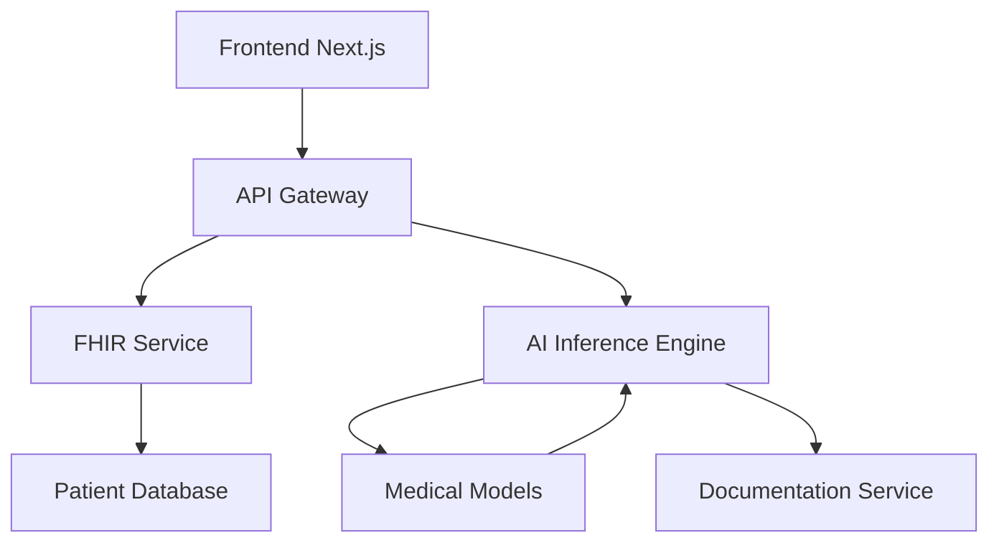

## Overview

Sovadina builds full-stack AI applications tailored for healthcare. You leverage Next.js for responsive frontends, Python for robust backends, and AI models to automate processes like medical documentation. The platform integrates FHIR standards to ensure compliant data handling across HealthTech solutions.

Core principles focus on modularity, scalability, and security. You structure applications around microservices that communicate via APIs, enabling seamless updates without downtime.

<Callout kind="info">
  Familiarize yourself with FHIR resources early, as they form the backbone of data exchange in Sovadina.
</Callout>

## Key Concepts

Explore the foundational pillars through these interactive overviews.

<Columns cols={2}>
  <Card title="Full-Stack AI Architecture" icon="layers" href="#architecture">
    Sovadina uses a layered approach: frontend for user interaction, backend for logic, and AI services for inference.
  </Card>
  <Card title="FHIR Integration" icon="database" href="#fhir">
    Standardize patient data with FHIR bundles, ensuring interoperability across systems.
  </Card>
  <Card title="AI Model Workflows" icon="zap" href="#ai-workflow">
    Deploy models for tasks like transcription and diagnosis support with containerized pipelines.
  </Card>
  <Card title="Documentation Automation" icon="file-text" href="#automation">
    Automate note generation from voice inputs using NLP models fine-tuned on medical corpora.
  </Card>
</Columns>

## System Architecture

Visualize how components interact in Sovadina's architecture.



This flow ensures data from patients routes through FHIR-compliant services before AI processing.

## FHIR Standards and Data Handling

You handle FHIR resources like Patient and Observation bundles for secure data exchange.

<Tabs>
  <Tab title="Reading FHIR Data" icon="download">
    Fetch patient records via standardized endpoints.

    <CodeGroup tabs="Python,JavaScript">
      ```python
      import requests
      fhir_url = "https://api.example.com/fhir/Patient/123"
      response = requests.get(fhir_url, headers={"Authorization": "Bearer YOUR_TOKEN"})
      patient = response.json()
      print(patient["name"][0]["text"])
      ```
      ```javascript
      const response = await fetch("https://api.example.com/fhir/Patient/123", {
        headers: { Authorization: "Bearer YOUR_TOKEN" }
      });
      const patient = await response.json();
      console.log(patient.name[0].text);
      ```
    </CodeGroup>
  </Tab>
  <Tab title="Writing FHIR Data" icon="upload">
    Create or update resources with validation.

    ```python
    fhir_data = {
      "resourceType": "Observation",
      "status": "final",
      "code": {"text": "Blood Pressure"},
      "valueQuantity": {"value": 120, "unit": "mmHg"}
    }
    requests.post("https://api.example.com/fhir/Observation", json=fhir_data)
    ```
  </Tab>
</Tabs>

## AI Model Integration Workflow

Follow these steps to integrate AI models into your Sovadina applications.

<Steps>
  <Step title="Prepare Model" icon="cpu">
    Containerize your model using Docker for Python-based inference.
  </Step>
  <Step title="Expose Endpoint" icon="api">
    Deploy to a service like `https://api.example.com/ai/transcribe`.
  </Step>
  <Step title="Integrate in Backend" icon="settings">
    Call the endpoint from your Python FastAPI routes.
  </Step>
  <Step title="Validate Output" icon="check-circle">
    Ensure outputs align with FHIR Observation schemas.
  </Step>
</Steps>

<CodeGroup tabs="FastAPI Route">
  ```python
  from fastapi import FastAPI
  app = FastAPI()

  @app.post("/transcribe")
  async def transcribe_audio(audio: bytes):
      ai_response = requests.post("https://api.example.com/ai/transcribe", data=audio)
      fhir_obs = {
          "resourceType": "Observation",
          "valueString": ai_response.json()["text"]
      }
      return fhir_obs
  ```
</CodeGroup>

## Medical Documentation Automation Principles

Automate documentation by piping audio inputs through speech-to-text models, then enriching with context via LLMs.

Key principles:
- **Privacy First**: Process data on-device where possible.
- **Auditability**: Log all transformations with FHIR Provenance resources.
- **Accuracy**: Fine-tune models on domain-specific datasets.

<Expandable title="Advanced FHIR Provenance Example" default-open="false">
  Track changes in documentation workflows.

  ```json
  {
    "resourceType": "Provenance",
    "target": [{"reference": "Observation/456"}],
    "agent": [{"who": {"reference": "Practitioner/789"}}],
    "activity": {"coding": [{"code": "REVISION"}]}
  }
  ```
</Expandable>

<Callout kind="tip">
  Start with simple FHIR Patient reads before scaling to full automation pipelines.
</Callout>